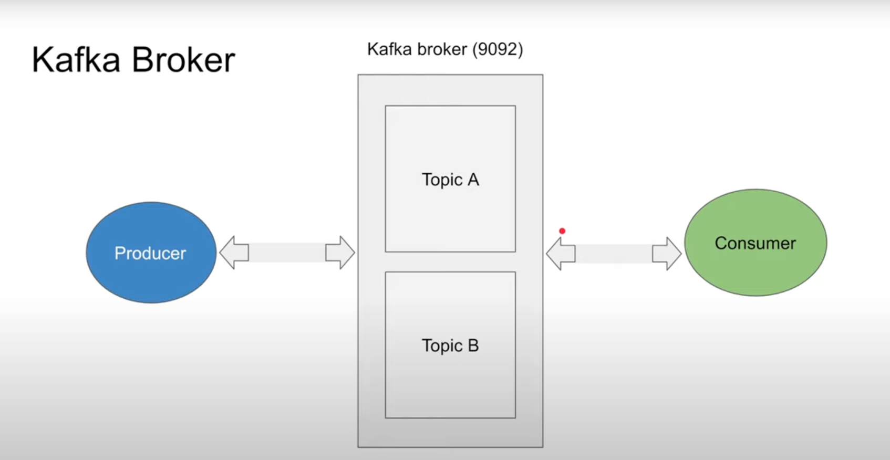
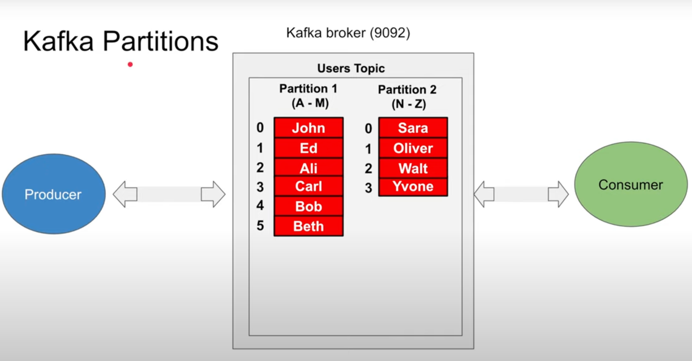
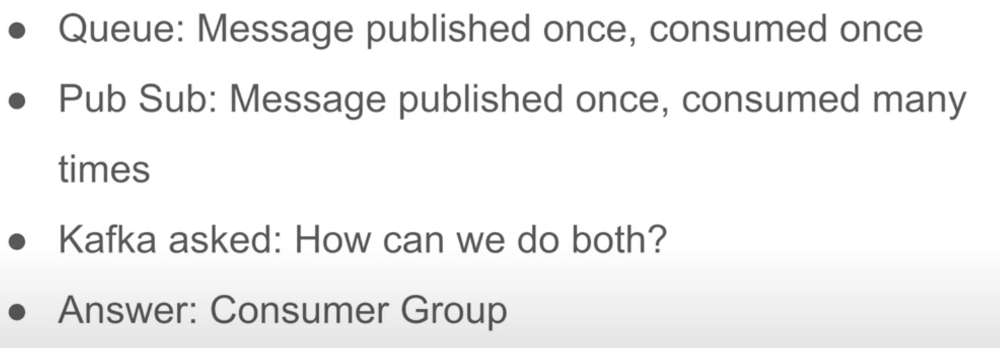
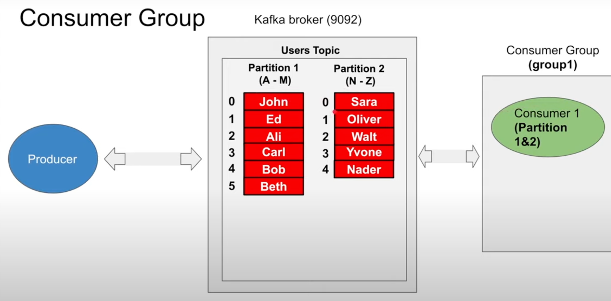
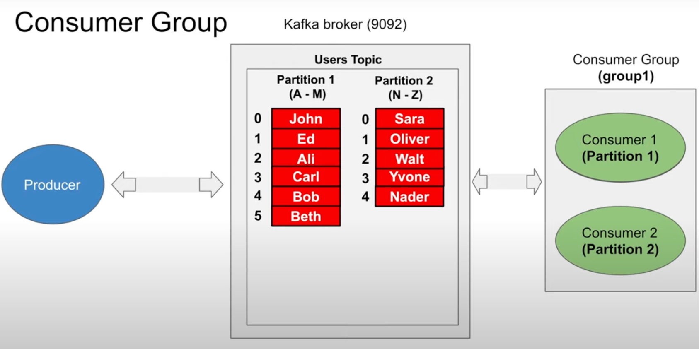
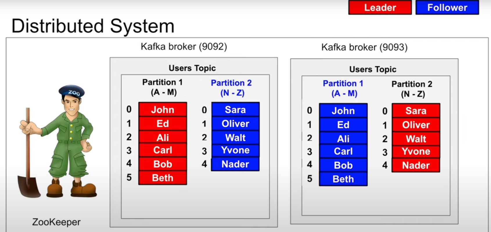

# Kafka

* Producer -> Topic within Kafka Broker (multiple brokers) -> Consumer

*  Topic can have multiple partitions. Similar concept to Database sharding.

* Queue Vs PubSub

* For Queue, have only one consumer group
  * A consumer within consumer group can subscribe to multiple partitions
    
  * But a partition can be consumed only by one consumer within a consumer group
    
  * Allocation of partitions to consumer within consumer group is taken care by Kafka framework
  * When one consumer, it consumes all partition. But when consumer scales the partitions are distributed within the available consumers
* For PubSub, have multiple consumer groups where each consumer group consumes the message from topic/partition
  * A partition can be consumed by multiple consumers from different consumer group
* When multiple brokers in Kafka cluster, leader and followers are decided at partition level rather than broker level. It is managed by Zookeper
  * Producer can write only to leader partition, and they are replicated to the followers
  * Consumer can read from both leader and followers
  
* Long polling
  * Kafka consumers does not have continuous polling.
  * Consumer polls and waits for message to receive. Waiting config can be either based on number of message/ total bytes etc
